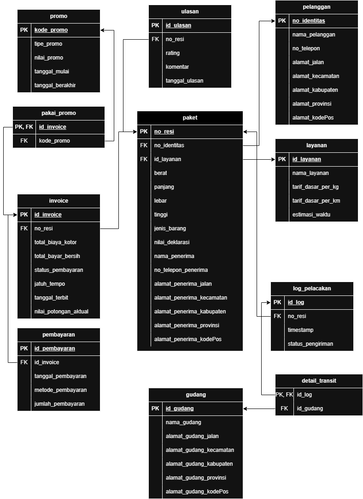

# Database SMBD - SiPaket Nyata

Repositori ini berisi implementasi basis data untuk studi kasus **SiPaket Nyata**, yaitu sistem logistik dan ekspedisi yang mengelola pelanggan, paket, layanan pengiriman, invoice, pembayaran, promo, pelacakan paket, gudang transit, dan ulasan pelanggan.

Proyek ini dibuat untuk memenuhi tugas besar mata kuliah **Sistem Manajemen Basis Data**.

## Anggota Kelompok

| Nama | NIM |
|---|---|
| Sheren Aulia Azahra | 103032400036 |
| Muhammad Hafiz Abdillah | 103032400153 |
| Mohamad Rizki Dwi Saputra | 103032430024 |
| Jonatannael Panjaitan | 103032430036 |

## Studi Kasus

SiPaket Nyata merupakan perusahaan logistik yang menyediakan layanan pengiriman barang, dokumen, dan paket. Sistem basis data dirancang untuk mendukung proses:

- pendaftaran pelanggan,
- pencatatan paket dan penerima,
- pemilihan layanan pengiriman,
- perhitungan biaya berdasarkan berat dan jarak,
- penggunaan promo,
- penerbitan invoice,
- pencatatan pembayaran,
- pelacakan status pengiriman,
- pencatatan transit gudang,
- pemberian ulasan setelah paket selesai dikirim.

## Struktur File

| File | Keterangan |
|---|---|
| `DDL_sipaketnyata.sql` | Data Definition Language. Berisi pembuatan database, tabel, constraint, function, dan trigger. |
| `DML_sipaketnyata.sql` | Data Manipulation Language. Berisi prosedur seeding data dummy untuk mengisi tabel master dan transaksi. |
| `DCL_sipaketnyata.sql` | Data Control Language. Berisi view, role, user, privilege, dan skenario keamanan database. |
| `schema_relation.png` | Gambar skema relasi basis data SiPaket Nyata. |
| `README.md` | Dokumentasi proyek untuk GitHub. |

## Skema Relasi



## Teknologi

- DBMS: MySQL
- Storage engine: InnoDB
- Character set: `utf8mb4`
- Collation: `utf8mb4_unicode_ci`

## Daftar Tabel

Database `db_sipaketnyata` terdiri dari tabel berikut:

| Tabel | Deskripsi |
|---|---|
| `pelanggan` | Menyimpan data pelanggan pengirim paket. |
| `layanan` | Menyimpan jenis layanan pengiriman dan tarif dasar. |
| `paket` | Menyimpan data paket, penerima, koordinat asal/tujuan, dan jarak pengiriman. |
| `invoice` | Menyimpan tagihan dan snapshot biaya pengiriman. |
| `pembayaran` | Menyimpan data pembayaran invoice. |
| `promo` | Menyimpan data promo diskon. |
| `pakai_promo` | Menyimpan relasi penggunaan promo pada invoice. |
| `ulasan` | Menyimpan rating dan komentar untuk paket yang selesai dikirim. |
| `log_pelacakan` | Menyimpan histori status pengiriman paket. |
| `gudang` | Menyimpan data gudang transit. |
| `detail_transit` | Menyimpan detail transit paket pada gudang tertentu. |

## Fitur Database

### 1. Constraint

Implementasi DDL menggunakan beberapa constraint untuk menjaga integritas data:

- `PRIMARY KEY`
- `FOREIGN KEY`
- `UNIQUE`
- `CHECK`
- `ON UPDATE CASCADE`
- `ON DELETE CASCADE` atau `ON DELETE RESTRICT` sesuai kebutuhan relasi

Contoh validasi yang diterapkan:

- rating ulasan hanya boleh 1 sampai 5,
- tipe promo hanya boleh `persentase` atau `nominal`,
- nilai promo persentase berada pada rentang 0 sampai 1,
- latitude berada pada rentang -90 sampai 90,
- longitude berada pada rentang -180 sampai 180,
- status pembayaran dan status pengiriman dibatasi sesuai domain yang ditentukan.

### 2. Perhitungan Jarak

Tabel `paket` menyimpan:

- `latitude_asal`
- `longitude_asal`
- `latitude_tujuan`
- `longitude_tujuan`
- `jarak_km`

Jarak dihitung menggunakan stored function `hitung_jarak_km` dengan rumus Haversine. Trigger `BEFORE INSERT` dan `BEFORE UPDATE` pada tabel `paket` akan menghitung `jarak_km` secara otomatis berdasarkan koordinat asal dan tujuan.

Alamat dalam bentuk teks tidak langsung dikonversi menjadi koordinat oleh MySQL. Dalam implementasi ini, latitude dan longitude diasumsikan diperoleh dari input aplikasi, input petugas, atau proses geocoding di luar database.

### 3. Snapshot Finansial Invoice

Tabel `invoice` menyimpan nilai biaya sebagai snapshot:

- `total_biaya_kotor`
- `nilai_potongan_aktual`
- `total_bayar_bersih`

Perhitungan biaya:

```text
total_biaya_kotor = (berat * tarif_dasar_per_kg) + (jarak_km * tarif_dasar_per_km)
```

Jika promo bertipe `persentase`:

```text
nilai_potongan_aktual = total_biaya_kotor * nilai_promo
```

Jika promo bertipe `nominal`:

```text
nilai_potongan_aktual = nilai_promo
```

Total bayar bersih:

```text
total_bayar_bersih = total_biaya_kotor - nilai_potongan_aktual
```

Snapshot digunakan agar histori invoice tidak berubah walaupun tarif layanan atau promo berubah di masa depan.

### 4. Validasi Ulasan

Ulasan hanya boleh dibuat jika status terakhir paket pada tabel `log_pelacakan` adalah `Selesai`.

Validasi ini diterapkan menggunakan trigger `BEFORE INSERT` dan `BEFORE UPDATE` pada tabel `ulasan`. Jika paket belum selesai, operasi akan ditolak menggunakan `SIGNAL SQLSTATE`.

### 5. Keamanan Database

File `DCL_sipaketnyata.sql` menerapkan skenario keamanan berbasis role:

| Role | Deskripsi |
|---|---|
| `role_super_admin` | Memiliki akses penuh terhadap database. |
| `role_operasional` | Mengelola paket, log pelacakan, dan detail transit. |
| `role_keuangan` | Melihat data invoice tertentu dan mencatat pembayaran. |
| `role_kurir` | Melihat status pengiriman dan menambah log pelacakan. |

User yang digunakan:

| User | Role |
|---|---|
| `rizki_owner` | `role_super_admin` |
| `hafiz_koordinator` | `role_operasional` |
| `sheren_keuangan` | `role_keuangan` |
| `jonatannael_kurir` | `role_kurir` |

Skenario DCL juga menggunakan `WITH GRANT OPTION` pada user koordinator agar user tersebut dapat meneruskan sebagian privilege tertentu.

Password pada file DCL adalah password demo untuk kebutuhan praktikum. Ganti password sebelum digunakan pada lingkungan produksi.

## Cara Menjalankan

Jalankan file SQL dengan urutan berikut.

### 1. Jalankan DDL

```bash
mysql -u root -p < DDL_sipaketnyata.sql
```

File ini akan membuat database `db_sipaketnyata`, seluruh tabel, constraint, function, dan trigger.

### 2. Jalankan DML

```bash
mysql -u root -p db_sipaketnyata < DML_sipaketnyata.sql
```

File ini akan mengisi data dummy menggunakan stored procedure `seed_sipaketnyata`.

### 3. Jalankan DCL

```bash
mysql -u root -p db_sipaketnyata < DCL_sipaketnyata.sql
```

File ini akan membuat view, role, user, dan privilege untuk skenario keamanan database.

## Jumlah Data Dummy

File `DML_sipaketnyata.sql` mengisi data dummy dalam jumlah besar untuk kebutuhan pengujian query dan skenario implementasi.

Secara umum data yang dibuat meliputi:

- 40 data pelanggan,
- 3 data layanan,
- 10 data promo,
- 10 data gudang,
- 120 data paket,
- 120 data invoice,
- data pembayaran sesuai status pembayaran,
- data log pelacakan untuk setiap paket,
- data detail transit,
- data ulasan untuk paket yang selesai dikirim.

## Catatan Implementasi

- Atribut `dimensi` tidak disimpan sebagai kolom karena merupakan atribut turunan dari `panjang * lebar * tinggi`.
- `jarak_km` disimpan sebagai snapshot karena digunakan untuk menjaga konsistensi perhitungan tarif.
- Data invoice disimpan sebagai snapshot finansial agar tidak berubah ketika master data tarif atau promo berubah.
- Relasi `pakai_promo` menggunakan `id_invoice` sebagai primary key agar satu invoice hanya menggunakan satu promo.
- Relasi `ulasan` menggunakan unique constraint pada `no_resi` agar satu paket hanya memiliki satu ulasan.

